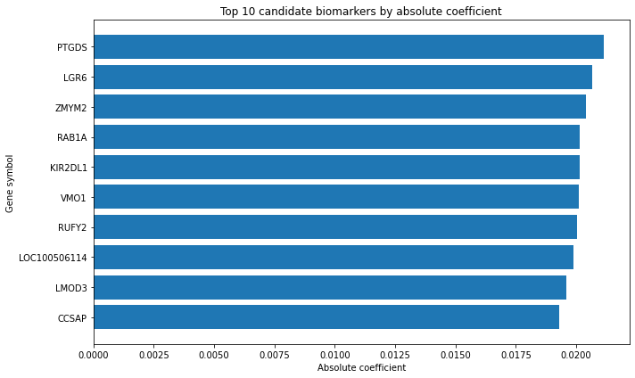

# 🧬 Machine Learning for Blood Transcriptomic Biomarkers of Parkinson’s Disease

## Overview

This project explores whether peripheral blood gene expression data can be used to distinguish patients with idiopathic Parkinson’s disease (PD) from healthy controls using machine learning.

The analysis is based on the publicly available GEO dataset **GSE99039**, which contains whole-blood transcriptomic profiles.

---

## 🎯 Objective

To evaluate the predictive power of blood transcriptomics and identify candidate gene biomarkers associated with Parkinson’s disease.

---

## 📊 Dataset

* Source: GEO (Gene Expression Omnibus)
* Accession: GSE99039
* Platform: Affymetrix GPL570
* Samples: 438 (205 PD, 233 controls)
* Features: ~54,000 gene expression probes

---

## Data Access

The analysis is based on the public GEO dataset GSE99039:
https://www.ncbi.nlm.nih.gov/geo/query/acc.cgi?acc=GSE99039 (GSE99039_series_matrix.txt)

Due to data size and licensing considerations, the dataset is not included in this repository.
It should be downloaded separately from GEO (Gene Expression Omnibus).

---

## ⚙️ Methods

* Data preprocessing and cohort selection (PD vs control)
* Logistic Regression baseline
* 5-fold stratified cross-validation
* Model comparison:

  * Logistic Regression
  * Support Vector Machine (SVM)
  * Random Forest
* Feature selection (ANOVA / SelectKBest)
* Model interpretation using coefficients

---

## How to Run

1. Clone the repository
2. Install dependencies:
   pip install -r requirements.txt
3. Open `notebook.ipynb` in Jupyter Notebook or JupyterLab
4. Run the cells sequentially

---

## 📈 Results

| Model               | ROC-AUC |
| ------------------- | ------- |
| Logistic Regression | ~0.71   |
| SVM                 | ~0.71   |
| Random Forest       | ~0.65   |

Key findings:

* Blood transcriptomic data contains a moderate but reproducible predictive signal
* Linear models outperform nonlinear models in this high-dimensional setting
* Feature selection using simple univariate methods reduces performance
* The signal appears distributed across many genes

---

## Model Interpretation

Top features (genes) identified by the model:


These genes represent the strongest contributors to the model’s classification of PD vs control.

---

## 🧬 Candidate Genes

Top genes identified by the model include:

* **PTGDS** (literature-supported)
* **KIR2DL1** (immune-related)
* **LGR6**, **ZMYM2**, **RUFY2** (novel candidates)

These genes represent potential transcriptomic biomarkers but require further biological validation.

---

## ⚠️ Limitations

* High dimensionality vs small sample size
* Probe-to-gene mapping ambiguity
* No external validation dataset

---

## 🚀 Future Work

* Regularized models (L1 / Elastic Net)
* Pathway and enrichment analysis
* External validation
* Advanced interpretability methods

---

## 📁 Structure

```
notebook.ipynb   # main analysis notebook
README.md        # project description
requirements.txt # dependencies
.gitignore       # ignored local/system files
LICENSE          # MIT license
```

## 🧠 Key Insight

Parkinson’s disease–related transcriptomic signatures in blood are subtle and distributed, requiring careful modeling and interpretation.

---

## 📌 Author

Alexander Groshkov

---

## 📚 References

* GEO dataset GSE99039
* Singleton AB et al. (2013), *The Lancet Neurology*
* Vivier E et al. (2011), *Science*
* PTGDS expression in PD (PubMed: 36010675)
* NCBI Gene / UniProt annotations

---

## Acknowledgements

This project was developed with the assistance of AI tools, including ChatGPT, which was used to support code structuring, debugging, and explanation of machine learning concepts.

All modeling decisions, analysis, and interpretations were performed by the author.
