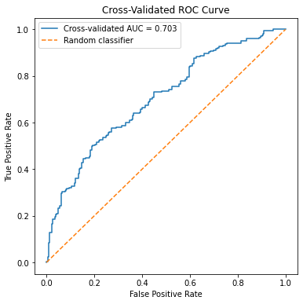
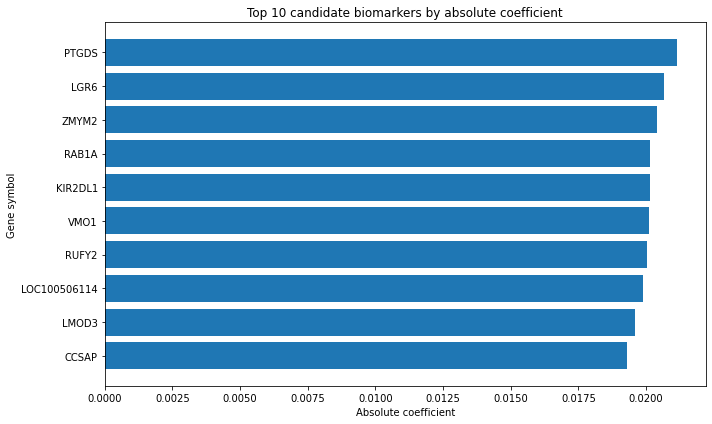
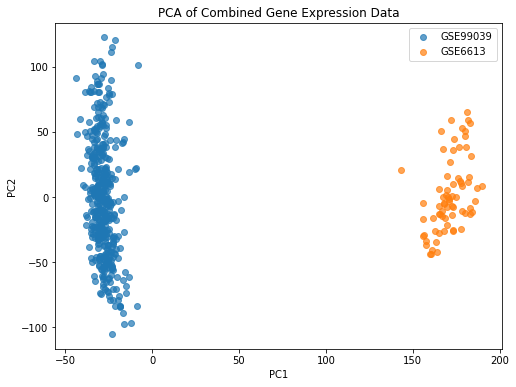
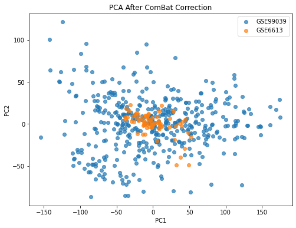
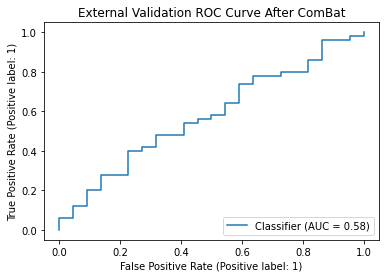
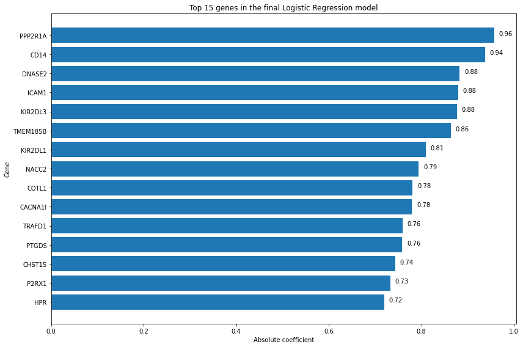

# Machine Learning for Blood Transcriptomic Biomarkers of Parkinson’s Disease

## Overview

This project investigates whether peripheral blood transcriptomic profiles can be used to distinguish patients with Parkinson’s disease (PD) from healthy controls using machine learning.

The work consists of two complementary studies:

Within-cohort modeling (**GSE99039**) – development and evaluation of machine learning models using cross-validation.
Cross-cohort external validation (**GSE6613**) – independent validation of trained models across a separate dataset with batch-effect correction and gene-level harmonization.

---

## Objective

To evaluate whether blood transcriptomic profiles can distinguish Parkinson’s disease patients from healthy controls, identify candidate biomarkers, and assess model generalization across independent cohorts.

---

## Datasets

### Training Cohort — GSE99039

* Source: GEO (Gene Expression Omnibus):
  https://www.ncbi.nlm.nih.gov/geo/query/acc.cgi?acc=GSE99039
  (GSE99039_series_matrix.txt)
* Accession: GSE99039
* Platform: Affymetrix GPL570
* Samples: 438 (205 PD, 233 controls)
* Features: ~54,000 gene expression probes

### External Validation Cohort — GSE6613

* Source: GEO (Gene Expression Omnibus):
  https://www.ncbi.nlm.nih.gov/geo/query/acc.cgi?acc=GSE6613
  (GSE6613_series_matrix.txt)
* Accession: GSE6613
* Platform: Affymetrix GPL96
* Samples: 72 (50 PD, 22 controls)
* Features: ~22,000 gene expression probes

---

## Methods

* Data preprocessing and cohort selection (PD vs control)
* Logistic Regression baseline
* 5-fold stratified cross-validation
* Model comparison:

  * Logistic Regression
  * Support Vector Machine (SVM)
  * Random Forest
  * L1 Logistic Regression
  * Elastic Net Logistic Regression
* External validation using an independent cohort (GSE6613)
* Gene-level harmonization across microarray platforms
* ComBat batch-effect correction
* Feature selection (ANOVA / SelectKBest)
* Model interpretation using coefficients

---
## Study 1: Within-Cohort Modeling (GSE99039)

## Results

| Model | Mean ROC-AUC | Std |
|---|---:|---:|
| SVM | 0.711 | 0.024 |
| Logistic Regression | 0.707 | 0.022 |
| L1 Logistic Regression | 0.658 | 0.037 |
| Random Forest | 0.650 | 0.042 |
| Elastic Net | 0.637 | 0.032 |

Key findings:

* Blood transcriptomic data contains a moderate but reproducible predictive signal
* An initial 80/20 train-test split produced ROC-AUC ≈ 0.64, while 5-fold cross-validation provided a more stable estimate of model performance.
* Linear models outperform nonlinear models in this high-dimensional setting
* ANOVA/SelectKBest with top 500 probes reduced Logistic Regression performance to ROC-AUC ≈ 0.623 ± 0.046.
* L1 Logistic Regression selected approximately 499 probes out of 54,675.
* Neither L1 regularization nor Elastic Net improved predictive performance.
* Results suggest that the Parkinson’s disease transcriptomic signal is distributed across many weak features rather than a small number of dominant biomarkers.

Model Performance

---

## Candidate Genes

Top-ranked unique genes included PTGDS, LGR6, ZMYM2, RAB1A, KIR2DL1, VMO1, RUFY2, LMOD3, and CCSAP.
These genes represent potential transcriptomic biomarkers but require further biological validation.
PTGDS, KIR2DL1, LGR6, ZMYM2, and RUFY2 were selected for biological discussion.

Top features (genes) identified by the model:

These genes represent the strongest contributors to the model’s classification of PD vs control.

---
## Study 2: External Validation (GSE6613)

To evaluate model generalization, an independent Parkinson’s disease cohort (GSE6613) was used for external validation.

Key steps included:

* probe-to-gene conversion using GPL570 and GPL96 annotations,
* identification of shared genes,
* Principal Component Analysis (PCA),
* ComBat batch-effect correction,
* ANOVA feature selection,
* model comparison across multiple algorithms.

### Summary of Model Performance

| Pipeline                                | External ROC-AUC |
| --------------------------------------- | ---------------: |
| Probe-level harmonization               |             0.46 |
| Gene-level harmonization                |             0.50 |
| Gene-level + ComBat                     |             0.58 |
| Gene-level + Feature Selection          |             0.59 |
| Gene-level + ComBat + Feature Selection |         **0.63** |

The main improvement came from preprocessing rather than classifier complexity: gene-level harmonization, ComBat correction, and feature selection had a larger impact than switching between ML algorithms.

### Batch Effect Before Correction

### Batch Effect After Correction

### Final External Validation ROC Curve

The final external validation pipeline achieved ROC-AUC ≈ 0.634 on the independent GSE6613 cohort.

### Top Genes from the Final Logistic Regression Model

The final Logistic Regression model was trained using:

* gene-level harmonization,
* ComBat batch correction,
* ANOVA feature selection,
* top 500 selected genes.

The top 15 genes ranked by absolute coefficient magnitude were:

These coefficients should be interpreted as model-associated features rather than causal disease genes.

### Literature Validation

To assess biological plausibility, top-ranked genes from the final model were compared with Parkinson’s disease and neuroinflammation literature.

| Gene              | Evidence in Parkinson’s Disease                                | Immune / Neuroinflammation Relevance | Interpretation                                                                     |
| ----------------- | -------------------------------------------------------------- | ------------------------------------ | ---------------------------------------------------------------------------------- |
| **PTGDS**         | Reported as differentially expressed in blood-based PD studies | Indirect                             | Strong candidate identified in both the original and externally validated analyses |
| **CD14**          | Associated with immune alterations in PD patients              | Strong                               | Marker of monocytes and innate immune activation                                   |
| **ICAM1**         | Reported among inflammatory markers in PD                      | Strong                               | Involved in leukocyte adhesion and inflammatory responses                          |
| **KIR2DL1**       | Limited direct PD evidence                                     | Strong                               | Regulates NK-cell activity and innate immune responses                             |
| **KIR2DL3**       | Limited direct PD evidence                                     | Strong                               | Supports the role of NK-cell signaling in PD-associated immune dysregulation       |
| **KIR3DL1**       | Limited direct PD evidence                                     | Strong                               | Additional NK-cell receptor identified among important model features              |
| **ITGAM (CD11b)** | Frequently linked to immune activation                         | Strong                               | Classical marker of myeloid cells and inflammatory responses                       |
| **PTK2B**         | Implicated in neurodegenerative pathways                       | Moderate                             | Participates in neuronal and immune signaling pathways                             |
| **PSAP**          | Biologically relevant to neurodegeneration                     | Moderate                             | Involved in lysosomal function, a pathway implicated in PD                         |
| **P2RX1**         | Limited direct PD evidence                                     | Moderate                             | Purinergic receptor involved in immune activation and inflammation                 |

Key findings:

* Internal cross-validation on GSE99039 produced a mean ROC-AUC of approximately **0.70**, indicating the presence of a reproducible transcriptomic signal associated with Parkinson’s disease.
* Direct external validation initially failed, with performance close to random prediction (ROC-AUC ≈ **0.50**), highlighting substantial cross-study differences.
* Principal Component Analysis revealed a strong batch effect between cohorts.
* Application of **ComBat batch correction** substantially improved cohort alignment and increased external ROC-AUC.
* Additional feature selection further improved external validation performance.

The best-performing pipeline consisted of:

* gene-level harmonization,
* ComBat batch correction,
* ANOVA-based feature selection (top 500 genes),
* Logistic Regression classification.

This approach achieved an external ROC-AUC of approximately **0.63** on the independent GSE6613 cohort.

Model interpretation identified several biologically plausible candidate genes, including **PTGDS**, **CD14**, **ICAM1**, **KIR2DL1**, **KIR2DL3**, **ITGAM**, and **PTK2B**. Many of these genes are involved in immune regulation, innate immunity, and inflammatory signaling pathways.

---
## Limitations

* High dimensionality vs small sample size
* Moderate predictive performance (ROC-AUC ≈ 0.63–0.71)
* Limited cohort sizes
* Cross-platform differences between microarray datasets
* Potential residual batch effects

---

## Future Work

* Pathway and enrichment analysis
* SHAP and permutation-based interpretability methods
* Integration of additional Parkinson’s disease cohorts
* Multi-cohort training strategies
* RNA-seq validation
---

## References

1. Gene Expression Omnibus (GEO).
   GSE99039: Blood-based transcriptomic profiling of Parkinson’s disease patients and healthy controls.

2. Gene Expression Omnibus (GEO).
   GSE6613: Whole blood gene expression dataset used as an independent external validation cohort.

3. Soreq, L., Bergman, H., Israel, Z., & Soreq, H. (2013).
   Major shifts in glial regional identity are a transcriptional hallmark of human brain aging. *Cell Reports*, 18(2), 557–570.

4. Singleton, A. B., Farrer, M. J., & Bonifati, V. (2013).
   The genetics of Parkinson’s disease: progress and therapeutic implications. *The Lancet Neurology*, 12(5), 500–512.

5. Makarious, M. B., Leonard, H. L., Vitale, D., et al. (2022).
   Blood-based RNA biomarkers for Parkinson’s disease identified in discordant monozygotic twins.
   Available at: https://pubmed.ncbi.nlm.nih.gov/36010675/

6. Leavy, O. (2014).
   Neurodegenerative diseases: Innate immunity in Parkinson disease. *Nature Reviews Immunology*, 14, 357.

7. Vivier, E., Raulet, D. H., Moretta, A., et al. (2011).
   Innate or adaptive immunity? The example of natural killer cells. *Science*, 331(6013), 44–49.

8. Abel, A., & Funk, C. D. (2016).
   Metabolism of prostaglandins and the role of prostaglandin D synthase (PTGDS) in neurological disease. *Journal of Lipid Research*.

9. Hirsch, E. C., Standaert, D. G. (2021).
   Ten unsolved questions about neuroinflammation in Parkinson’s disease. *Movement Disorders*, 36(1), 16–24.

10. Tansey, M. G., Romero-Ramos, M. (2019).
    Immune system responses in Parkinson’s disease: Early and dynamic. *European Journal of Neuroscience*, 49(3), 364–383.

11. NCBI Gene Database.
    Gene records for PTGDS, CD14, ICAM1, KIR2DL1, KIR2DL3, ITGAM, PTK2B, and PSAP.

12. UniProt Knowledgebase (UniProtKB).
    Functional annotations for genes discussed in the biological interpretation section.

---

## Acknowledgements

This project was developed with the assistance of AI tools, including ChatGPT, which was used to support code structuring, debugging, and explanation of machine learning concepts.

All modeling decisions, analysis, and interpretations were performed by the author.
